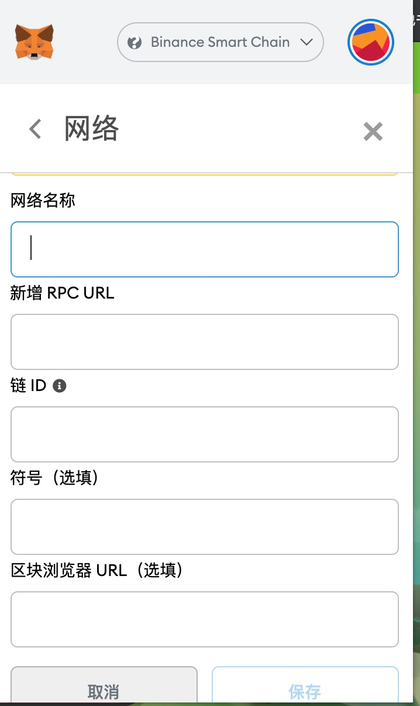

# Plant vs Undead 植物大战僵尸

游戏玩法：植物大战僵尸+农场，目前只有农场玩法，pve和pvp模式只出了一个测试包；现在农场也正在维护，准备升级到农场2.0（2021-08-20 08:00）；
相对于1.0主要变动有以下几点：减少地主的收益，减少农民的内卷，减少机器人


## 游戏货币

+ **LE**：游戏货币
+ **PVU**：游戏代币 可以在薄饼上买卖


汇率：
100 LE -> 1  PVU
1 PVU -> 70 LE 


## 游戏道具

道具名称 | 价格 | 有效期 | 收益 | 用途
--- | --- | --- | --- | ---
大盆 | 100LE | 30天 | - | 提升种子掉落几率
小盆 | 50LE | 10天 | - | 种植向日葵树苗或植物
水 | 50LE | 100次 | - | 给植物浇水
稻草人 | 20LE | - | - | 追赶乌鸦
向日葵树苗 | 100LE | 3天 | 250LE/3天 | 种植在小盆中，三天收250LE,收完消失
向日葵妈妈 | 200LE | 6天 | 850LE/6天 | 种植在大盆中，6天收850LE，收完消失
种子 | 100PVU | - | - | 种植在小盆中，随机长成各类型植物、或母树
植物 | - | - | - | 有机率掉落种子
母树 | - | - | - | pve必须要的
土地 | 很贵 | - | - | 免费的只有6个插槽

!> 每个用户有块免费土地，六个插槽，一个用于种植母树，五个用于植物。

## 农场玩法

土地满载的最低收益计算(6天一个周期,不算树苗掉落)：

	五棵树苗：250 * 5 * 2 = 2500LE

	一棵母树： 850LE

	日常：50 * 6 = 300LE

	总收益 = 3650LE

成本：

	11个小盆： 50 * 11 = 550LE

	水：（15 + 12）* 6 * 6 * 100/100 = 1000LE

	稻草人： 随机的，大概预估每天每颗植物出现五只乌鸦  5次 * 6植物 * 6天 * 20/20单价 = 180LE

	总支出 = 1730LE

每天大概收益是1920/6 = **320LE** = 3.2PVU （需要5%手续费）；

按教程时的18美金市值(手续费大概5%)：18U * 3.75 * 6.4 * 95% = 400,每天大概400RMB左右的收益.

+ 初阶玩法-5PVU

刚进游戏可以先去完成每日浇水任务获取50LE，还有几率掉落树苗；然后买乌鸦道具20LE。

购买五个PVU，转换成350LE；

购买二个植物+二个小盆+水+乌鸦道具：100 * 2+50 * 2+50+20 = 370LE。

收益：250 * 2 + 50 * 3 = 650LE/3天

每三天可以多种植1 ~ 2棵树苗，如果运气好，浇水或者追赶乌鸦时掉落树苗则会更快更快，最多九天差不多就可以种满免费的土地。


## 如何开始

1. 游戏使用的是狐狸钱包，需要在google市场下载狐狸钱包插件，创建狐狸钱包帐号；**请一定要自己操作，并保存好助记词并不要告之他人，它是你钱包的帐号和密码**

2. 然后去[官网](https://plantvsundead.com/)创建帐号,自定义rpc网络新增BSC链

> 由于玩家过大，应该还是会采用分批进入游戏的方式，新建的帐号可能需要等待24小时才会进入队列，游戏还未维护完成，具体规则还未出来只是猜测。



添加如下内容
```
网络名称：Binance Smart Chain
rpc url ：  https://bsc-dataseed.binance.org/
链id： 56
符号： BNB
区块浏览器： https://bscscan.com
```

3. 游戏是发布在BSC链上的，PVU可以在[薄饼](https://pancakeswap.finance/swap?outputCurrency=0x31471e0791fcdbe82fbf4c44943255e923f1b794)上交易获取；

4. 购买PVU,并在游戏中换取LE，开始游戏

## 参考资料

+ [官网](https://plantvsundead.com/)
+ [薄饼](https://pancakeswap.finance/swap?outputCurrency=0x31471e0791fcdbe82fbf4c44943255e923f1b794)
+ [官方文档](https://plantvsundead.medium.com/)


**联系我**

+ [telegrem](https://t.me/playforearn)
+ qq群：681316041


